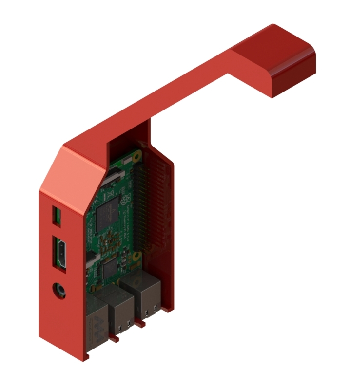
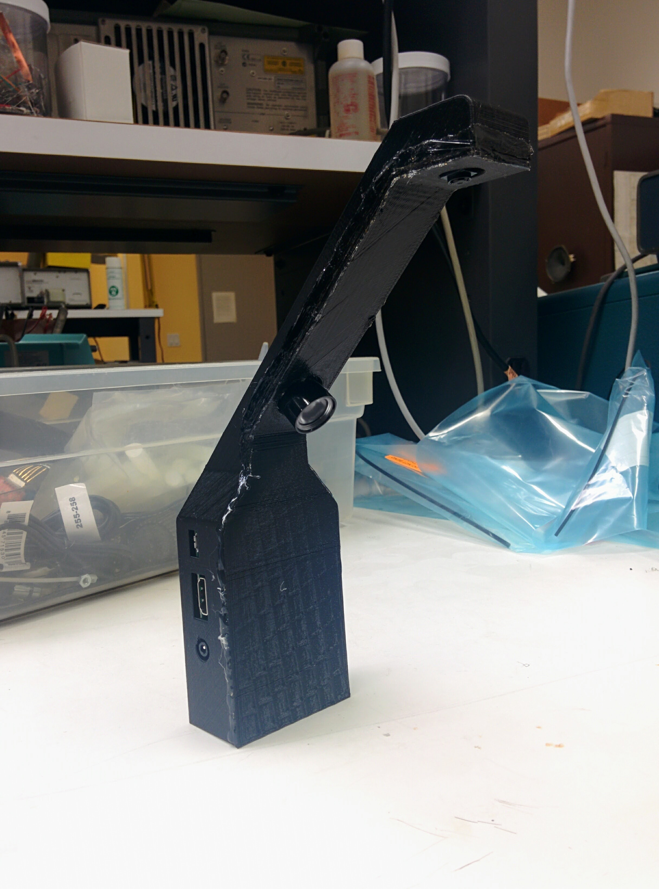

# CribSense Overview

CribSense is an video-based, contactless baby monitor that you can make yourself without breaking the bank.

CribSense is a C++ implementation of [Video Magnification](http://people.csail.mit.edu/mrub/vidmag/) tuned to run on a Raspberry Pi 3 Model B. Over a weekend, you can setup your own crib-side baby monitor that raises an alarm if your infant stops moving. As a bonus all of the software is free to use for non-commercial purposes and easily extensible.

While we think CribSense is pretty fun, it's important to remember that this isn't actually a certified, foolproof safety device. That is, there will be plenty of times it doesn't work. For example, if it isn't calibrated well and/or the environment in the video isn't conducive to video magnification, you may not be able to use it. We made this just as a fun side project to see how well we could have compute-heavy software like video magnification run on compute-limited hardware like a Raspberry Pi. Any real product would require much more testing than we have done. So, if you use this project, take it for what it is: a short exploration of video magnification on a Pi.

## Getting Started
CribSense is made up of two parts: the baby monitoring software and some simple hardware. Find out all you need to know about how to use and recreate your own monitor in the sections below.

### Software

To install the prerequisites, build the software, or learn more about the software architecture, see the [Software Setup Guide](setup/sw-setup.md)

### Hardware

To learn more about the hardware materials we used, and how we build our setup, check out the [Hardware Setup Guide](setup/hw-setup.md)

## Video Walkthroughs

### Calibrating CribSense
<iframe width="560" height="315" src="https://www.youtube.com/embed/zSiRmgIE3pY?rel=0" frameborder="0" allowfullscreen></iframe>

### CribSense Demonstration
<iframe width="560" height="315" src="https://www.youtube.com/embed/zvy1fXIjGgA?rel=0" frameborder="0" allowfullscreen></iframe>
