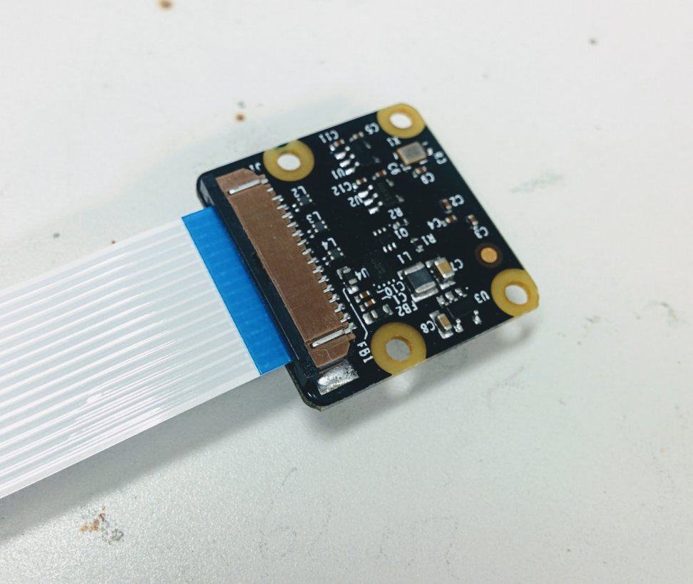
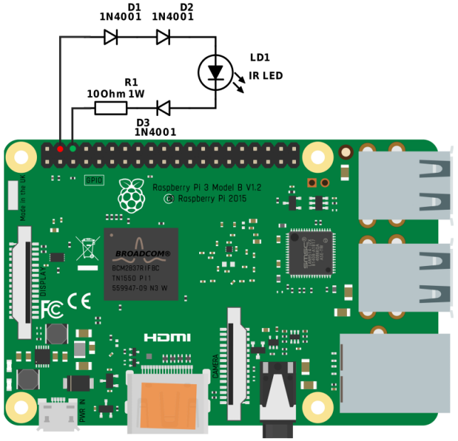

# Hardare Setup Guide

**Figure TODO: Hardware Block Diagram**

CribSense is relatively simple as far as hardware goes, and is largely made up of commercially available items. As seen in Figure TODO, there are only 5 main hardware components, and only 2 of them are custom made. This page will walk through how to construct the IR LED circuit, and the chassis we used.

## What you'll need

Raspberry Pi + Camera + configuration tools:

-   [Raspberry Pi 3 Model B](https://www.amazon.com/Raspberry-Pi-RASP-PI-3-Model-Motherboard/dp/B01CD5VC92/)
-   [5V 2.5A Micro USB Power Supply](https://www.amazon.com/gp/product/B00MARDJZ4/)
-   [Raspberry Pi NoIR Camera Module V2](https://www.amazon.com/Raspberry-Pi-NoIR-Camera-Module/dp/B01ER2SMHY)
-   [1W IR LED](https://www.amazon.com/DIYmall%C2%AE-Infrared-Adjustable-Resistor-Raspberry/dp/B00NUOO1HQ)
-   [MicroSD Card](https://www.amazon.com/Samsung-Class-Adapter-MB-MP32DA-AM/dp/B00IVPU7KE) (we went with a class 10 16GB card, the faster the card the better)
-   [Flex Cable for Raspberry Pi Camera (12")](https://www.adafruit.com/products/1648)
-   Speakers with 3.5mm input
-   HDMI monitor
-   USB Keyboard
-   USB Mouse
-   \[optional] [Raspberry Pi Heatsink](https://www.amazon.com/LoveRPi-Heatsink-Raspberry-Model-Heatsinks/dp/B018BGRDVS/) If you're worried about heat, you can stick these onto your Pi.

IR LED Circuit for low-light operation:

-   [\[3x\] 1N4001 diodes](https://www.adafruit.com/product/755)
-   [1 ohm, 1W resistor](http://www.parts-express.com/10-ohm-1w-flameproof-resistor-10-pcs--003-1)
-   [2x] 12" Wires with pin headers
-   Soldering iron

Chassis:

-   3D printer for chassis
-   Hot glue gun + plenty of hot glue

## Prerequisites

Before you start our step-by-step guide, you should have already installed the latest version of [Raspbian](https://www.raspberrypi.org/downloads/raspbian/) on your SD card and ensured that your Pi is functional and booting. You'll also need to [enable the camera module](https://www.raspberrypi.org/documentation/configuration/camera.md) before you'll be able to interface with the camera.

## Build Instructions

### Swap NoIR Camera Cable

The cable that comes with the camera is much too short. That's why you bought the longer one. Swap the short one with the long one. To do this, you can follow [this guide from ModMyPi](https://www.modmypi.com/blog/how-to-replace-the-raspberry-pi-camera-cable). It you don't feel like clicking through, it's simple. On the back of the NoIR Camera, there is a push/pull tab just like the one found on the Pi itself:

Simply pull the black plastic tab out, remove the short cable, replace it with the long cable (making sure that the blue plastic strip is facing up still as shown in the picture), and push the tab back in to secure it.

### 3D Printed Chassis

Using our chassis is entirely optional. In fact, we're confident you could make something better. Two of the biggest weaknesses are:

-   It's hot-glued together, so it's not easy to re-open and change things.
-   It doesn't have a built-in way to attach to a crib. Some options are 3M mounts, Velcro, or tape.
    We just provide a simple chassis (along with its source files) that we used while developing CribSense as a starting point. This is how we set it up.

TODO: William to fill in instructions about how to use the source files to print out the chassis (or links to good tutorials)

### IR LED Circuit

In order to provide adequate lighting at night, we use an IR LED, which is not visible to the human eye, but brightly illuminating for our NoIR camera. Because the Pi is plugged in, and because the LED is relatively low power, we just leave it on for simplicity.

To power the LED from the GPIO header pins on the Pi, we construct the circuit in Figure TODO.

**Figure TODO: LED Schematic**

In earlier versions of the Pi, the maximum current output of these pins was [50mA](http://pinout.xyz/pinout/pin1_3v3_power). The Raspberry Pi B+ increased this to 500mA. However, for simplicity and backwards compatibility, we just use the 5V power pins, which can supply up to [1.5A](http://pinout.xyz/pinout/pin2_5v_power). The forward voltage of the IR LED is about 1.7~1.9V according to our measurements. Although the IR LED can draw 500mA without damaging itself, we decided to reduce the current to around 200mA to reduce heat and overall power consumption. Experimental result also show that the IR LED is bright enough with this input. To bridge the gap between 5V and 1.9V, we decided to use three 1N4001 diodes and a 1 Ohm resistor in series with the IR LED. The voltage loss on the wire is about 0.2V, over the diodes it's 0.9V (for each one), and over the resistor it's 0.2V. So the voltage over the IR LED is `5V - 0.2V - (3 * 0.9V) - 0.2V = 1.9V`. The heat dissipation over each LED is 0.18W, and is 0.2W over the resistor, all well within the maximum ratings.

The circuit should looking something like this:

But, we're not done yet! In order to get a better fit into the 3D printed chassis, we want to have the IR LED lens protrude from our chassis and have the board flush with the hold. The small photodiode in the bottom right will get in the way. To remedy this, we desolder it and flip it to the opposite side of the board like this:

The photodiode isn't needed since we want the LED to always be on. Simply switching it to the opposite side leaves the original LED circuit unchanged.

### Assembly: Bring it all together

Once you have all the hardware ready, you can begin assembly. Throughout this process, make sure you give the hot glue enough tie to dry before moving on to the next step. Also, re recommend frequently checking that all the cables still have full access to all the ports, and that everything functions. Also note that anytime during the processes, hot glue is easily removed using isopropyl alcohol (we recommend at least 70% concentration). By soaking the glue (with the Pi powered off and unplugged, of course) with some alcohol, the bond of the glue will be weakened and you'll be able to peel the glue cleanly off. Be sure you let everything dry before reapplying hot glue. Click any of the picture below for larger resolution pictures.

-   Insert the Raspberry Pi into the chassis. Once it is set, be sure that all of the ports still work (e.g. you can plug in power power)

-   Next, we used hot glue to tack the Pi into place and attached the camera to the Pi. There are screw holes as well if you perfer to use those.

-   Now, we're going to glue the LED and camera to the front cover

-   We started by hot gluing the NoIR camera to the camera hole. Be sure that the camera is snug and lined up with the chassis. Also, make sure that you don't use too much glue so that you can still fit it onto the make chassis. Be sure to actually power on the Pi and take a look at the camera (`raspistill -v`, for example) to make sure that it is angled well and has a good field of view. If it isn't, remove the hot glue and reposition it.

-   Next, we glued the IR LED to the hole in the next of the Pi. It's at a 45 degree angle because the angle gives us more shadows (and thus more contrast) in low-light, making it easier to see motion.

-   With both of them glued to the neck, it should look like this

-   Attach the IR LED pins to the Pi's GPIO pins as shown in the LED Schematic figure.
-   Now, pack in the cables into the chassis in a way that don't crease or strain them. We ended up doing some switchbacks with our extra long camera flex cable.

-   With everything tucked in, we then hot-glued around the edge where the two pieces meet, sealing them in place.

